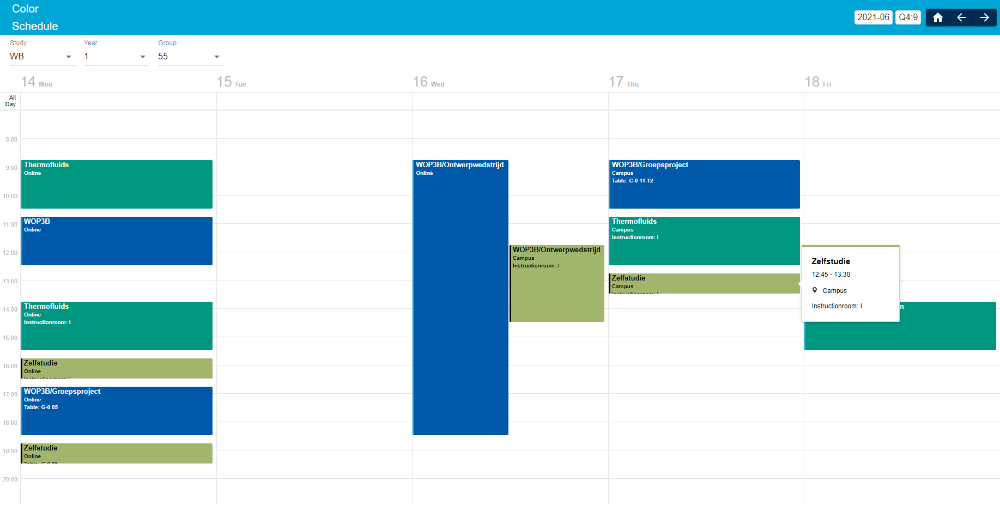

# ColorSchedule
Graphical interface for university schedules. This application can be used for displaying schedule data coming from an Excel file.

## Dependencies
NodeJS v16.3.0 
MongoDB 4.4.6

## Installation and usage
1. Clone the repository: `git clone git@github.com:VegetableArt/ColorSchedule.git`
2. Install dependencies: `cd ColorSchedule/colorschedule; npm install; cd ../csserver; npm install; cd ../`
3. Configure database in `csserver/server.js` and `csserver/xlsxToMongo.js`
4. Use `csserver/xlsxToMongo.js` to import the Excel file
5. Run the back-end server with `node csserver/server.js`
6. Run the front-end server with `cd colorschedule; npm start`
7. Visit `http://localhost:8080` to view the interface
8. Update Excel file via `http://localhost:8080/admin` whenever needed

## Example

## Known bugs
- The admin interface where the Excel file can be uploaded doesn't seem to work when the front-end server is started at another machine

## Notes
This software is made for educational purposes. The format of the Excel file can be requested.
